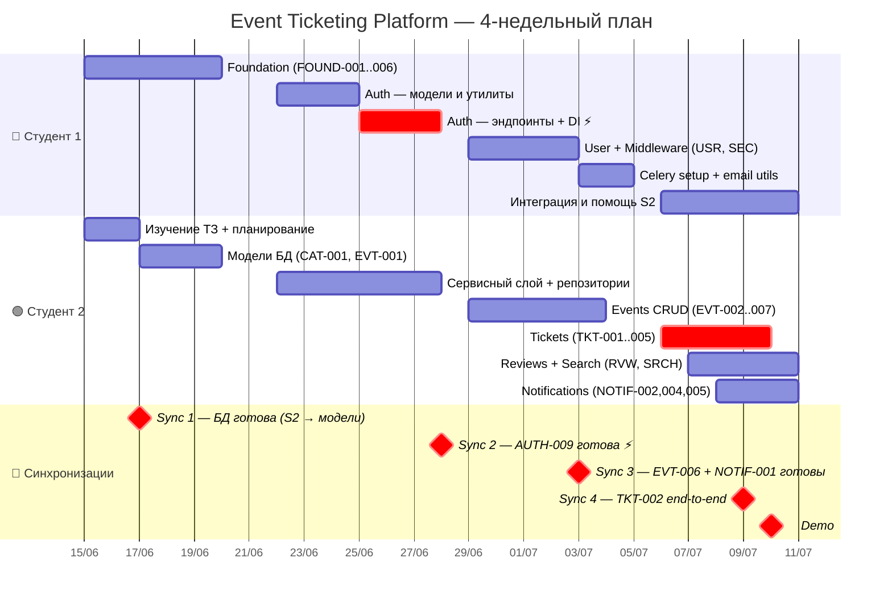

# Event Ticketing Platform — Timeline

## Обзор по неделям

|  | Неделя 1 | Неделя 2 | Неделя 3 | Неделя 4 |
|---|---|---|---|---|
| **S1** | Foundation | Auth (core) | Auth (finish) + User + Middleware + Celery | Интеграция / помощь |
| **S2** | Изучение ТЗ + Модели БД | Сервисный слой + подготовка | Events CRUD | Tickets + Reviews + Search + Notifications |
| **🔔** | Sync 1 (ср) | Sync 2 (пт) | Sync 3 (пт) | Sync 4 (ср) + Demo (пт) |

---

## Gantt-диаграмма



---

## Точки синхронизации — подробно

### 🔔 Sync 1 — Среда, Неделя 1 (17 июня)
**Триггер:** S1 завершает FOUND-003 (async SQLAlchemy настроен)

```
S1 → S2: «Репо готово, alembic работает, Base и get_db доступны — можешь создавать модели»
```

**S2 разблокируется:**
- `CAT-001` — модели Category, Tag, event_tags + миграция
- `EVT-001` — модель Event + миграция

**Что проверить перед Sync 1:**
- [ ] `alembic upgrade head` проходит на чистой БД
- [ ] S2 может клонировать репо и запустить `uvicorn app.main:app`

---

### 🔔 Sync 2 — Пятница, Неделя 2 (28 июня) ⚡ Критичная
**Триггер:** S1 завершает AUTH-009 (DI: `get_current_user`, `require_role`, `require_verified`)

```
S1 → S2: «Auth готов, DI доступны — можешь защищать эндпоинты и начинать Events CRUD»
```

**S2 разблокируется:**
- `EVT-002..007` — все Events эндпоинты с проверкой ролей
- `CAT-002` — Admin-only эндпоинты категорий
- Все эндпоинты где нужен `Depends(get_current_user)`

**Что проверить перед Sync 2:**
- [ ] `POST /auth/register` → `POST /auth/login` → access token получен
- [ ] `Depends(require_role(UserRole.organizer))` блокирует attendee → 403
- [ ] Blacklist работает: после logout токен не принимается

---

### 🔔 Sync 3 — Пятница, Неделя 3 (3 июля)
**Триггер:** S1 завершает NOTIF-001 (Celery), S2 завершает EVT-006 (публикация → Redis seats)

```
S2 → S2: «EVT-006 готова — можно начинать TKT-002»
S1 → S2: «Celery worker работает — можно вызывать задачи через .delay()»
```

**Разблокируется:**
- `TKT-002` — покупка билетов (требует Redis seats из EVT-006 + Celery из NOTIF-001)

**Что проверить перед Sync 3:**
- [ ] `PATCH /events/{slug}/publish` → `SET event:seats:{id} {capacity}` в Redis
- [ ] `celery -A app.core.celery worker` запускается без ошибок
- [ ] `send_ticket_confirmation.delay(1)` попадает в очередь

---

### 🔔 Sync 4 — Среда, Неделя 4 (9 июля)
**Триггер:** S2 завершает TKT-002 — полный поток покупки работает end-to-end

```
S2 → Все: «Покупка билетов работает, QR-код и email — проверено»
```

**Разблокируется:**
- Финальное интеграционное тестирование
- Подготовка к Demo (проверка сценариев из ТЗ)

**Что проверить на Sync 4:**
- [ ] Два параллельных запроса на последний билет — только один проходит
- [ ] Email с QR-кодом приходит на реальный ящик
- [ ] Отмена оплаты → места возвращаются в Redis

---

### 🎯 Demo — Пятница, Неделя 4 (10 июля)
**Сценарий демо** — по пунктам из ТЗ, раздел «Что клиент хочет видеть на демо»:

1. Регистрация двух аккаунтов (organizer + attendee)
2. Создание и публикация мероприятия
3. Покупка билетов → email с QR-кодом
4. Попытка купить когда мест нет → 409
5. Поиск по городу и категории
6. Отмена мероприятия → письма всем покупателям
7. Отзыв после посещения → рейтинг обновляется

---

## Риски и буферы

| Риск | Вероятность | Влияние | Митигация |
|---|---|---|---|
| AUTH-009 не готова к концу нед. 2 | Средняя | 🔴 Высокое — S2 простаивает | S1 делает auth DI в первую очередь в нед. 2 |
| TKT-002 занимает больше 4ч | Высокая | 🟠 Среднее — сдвиг нед. 4 | Заложен буфер в нед. 4 у S1 |
| Celery не работает локально | Низкая | 🟠 Среднее | Проверить NOTIF-001 в первый же день нед. 3 |
| EVT-006 забыли Redis seats | Средняя | 🔴 Высокое — TKT-002 сломан | Чеклист в Sync 3 |
