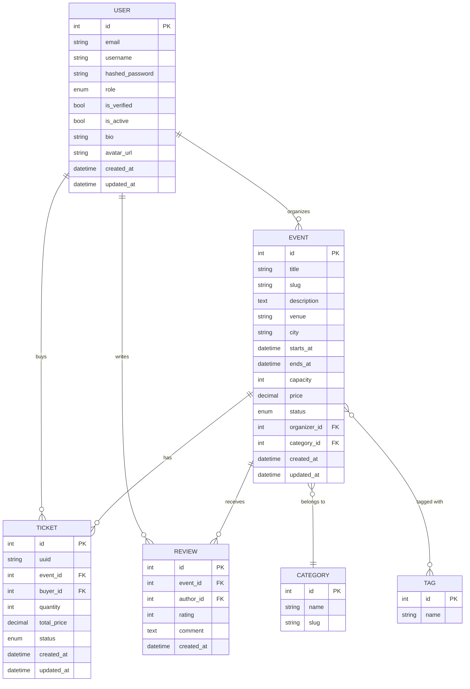
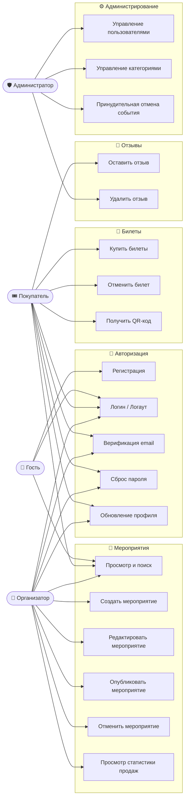
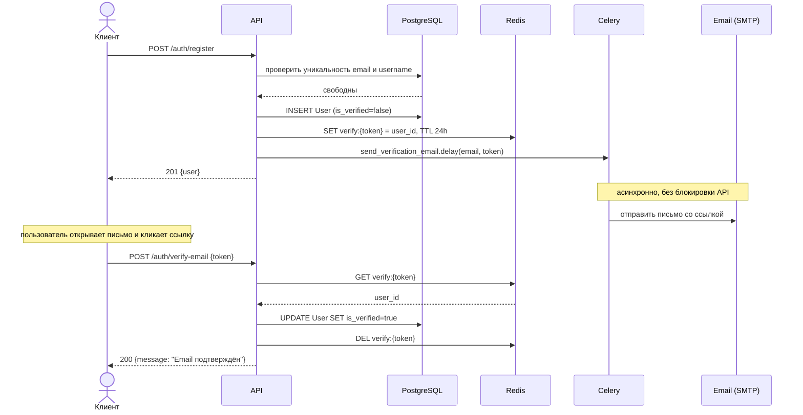
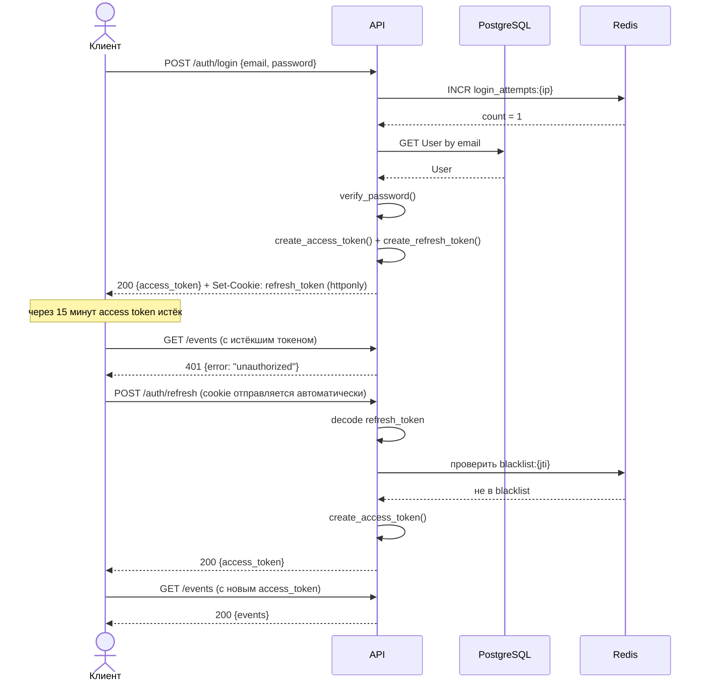
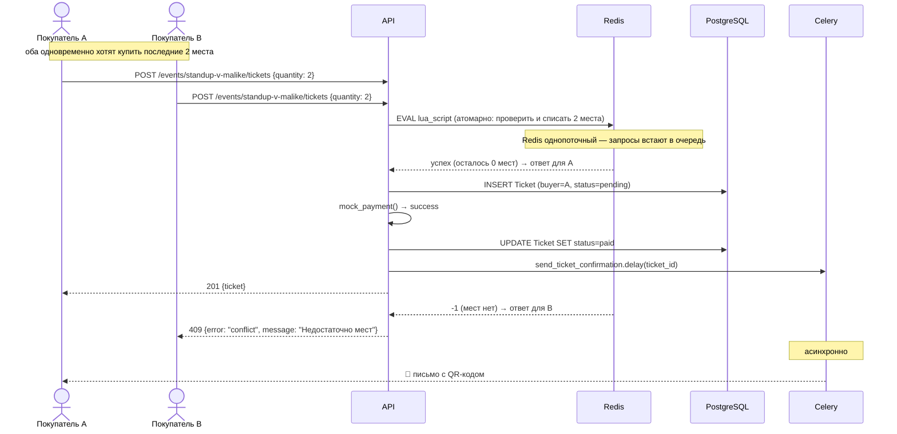

# Event Ticketing Platform — Техническое задание

> **Версия:** 1.0  
> **Статус:** Draft  
> **Стек:** FastAPI · PostgreSQL · SQLAlchemy · Alembic · Redis · Celery · Pydantic v2

---

## Предыстория — Клиент и его запрос

### Кто обратился

**Клиент:** Санжар Мирзаев, основатель ивент-агентства **«Vivid Events»** (Ташкент)

Санжар уже 4 года организует мероприятия в Узбекистане — корпоративы, концерты, бизнес-конференции, стендап-вечера. У него 6 человек в команде и портфель примерно 30–40 событий в год. Клиент пришёл по рекомендации — его знакомый уже работал с нашей компанией.

---

### Запись встречи (Discovery Call, 14 июня 2026)

> *Ниже — пересказ ключевых моментов первичной встречи с клиентом. PM вёл заметки.*

**Санжар:** Слушайте, у нас сейчас полный хаос. Продаём билеты через Instagram директ, деньги принимаем на карту, потом вручную в Excel отмечаем кто оплатил. На последнем концерте Dilnoza Yusupova продали 312 билетов, а зал был на 300. Пришлось троих людей разворачивать на входе. Это был кошмар, нам потом ещё и в Stories писали.

**PM:** Понятно. А организаторы — это только ваша команда, или вы планируете пускать других?

**Санжар:** В идеале хочу сделать платформу — чтобы любой организатор мог зарегистрироваться, создать своё мероприятие и продавать билеты. Мы берём комиссию. Что-то вроде Ticketmaster, но для нашего рынка.

**PM:** Какой минимум который вам нужен чтобы запуститься?

**Санжар:** Главное — регистрация, создание события, покупка билетов и чтобы на почту приходило подтверждение с QR-кодом. На входе мой человек будет сканировать QR. Всё остальное — потом.

**PM:** Отзывы, рейтинги нужны?

**Санжар:** Да, очень нужны. Люди хотят видеть что за организатор, какие отзывы о прошлых событиях. Это доверие.

**PM:** Оплата?

**Санжар:** Пока можно сделать заглушку — типа "оплата принята". Реальный эквайринг подключим позже, сначала хочу проверить идею.

**PM:** Напоминания о мероприятии слать?

**Санжар:** Обязательно! У нас постоянно люди забывают. За день до — точно нужно. И вообще хочу чтобы каждую неделю людям приходила подборка ближайших событий — как дайджест.

**PM:** А если мероприятие отменяется?

**Санжар:** Ну тогда всем купившим письмо. Это очевидно. И места должны освобождаться конечно.

**PM:** Поиск, фильтры?

**Санжар:** Да, люди хотят искать по городу, по типу события — концерт, конференция, спорт. По дате и цене. У нас Ташкент, Самарканд, Бухара — хотя бы города надо разделять.

---

### Что клиент хочет видеть на демо

Санжар явно дал понять что на финальной демонстрации хочет увидеть следующее:

1. **Регистрация двух аккаунтов** — один как организатор, один как покупатель
2. **Создание мероприятия** — с категорией, тегами, датой и ценой
3. **Покупка билетов** и получение **письма с QR-кодом** на реальный email
4. **Попытку купить билеты когда мест нет** — система должна отклонить
5. **Поиск по городу и категории** — найти своё мероприятие в списке
6. **Отмену мероприятия** — и проверить что всем пришло письмо
7. **Отзыв после посещения** — оставить оценку и посмотреть рейтинг

> *«Если это всё работает — я счастлив. Остальное допилим.»*
> — Санжар Мирзаев

---

### Что клиент НЕ просил (но было бы круто показать)

Это не обязательно, но если команда реализует — произведёт впечатление:

- **Статистика для организатора** — сколько билетов продано, динамика по дням
- **Промокоды** — скидочные коды для отдельных событий
- **Waitlist** — очередь если мест нет, автоуведомление при освобождении места
- **Экспорт списка гостей** в CSV для организатора

---

### Контекст для команды

- Клиент технически не подготовлен — он не знает что такое REST API, JWT или Redis. На демо показываем через Swagger или Postman, объясняем простыми словами.
- Бюджет и дедлайн не обсуждались — это учебный проект, но относитесь к нему как к реальному.
- Клиент может прийти с дополнительными вопросами — фиксируйте любые изменения требований письменно.

---

### Открытые вопросы к клиенту

После первой встречи остались моменты которые не обсудили. В реальном проекте их нужно закрыть до начала разработки — иначе команда будет принимать решения наугад и потом переделывать.

| # | Вопрос | Почему важно |
|---|---|---|
| 1 | Может ли организатор создать **бесплатное** мероприятие (price = 0)? | Влияет на валидацию поля price и flow покупки |
| 2 | Нужна ли **модерация** перед публикацией — кто-то должен проверить что событие реальное? | Если да — нужна роль Moderator и отдельный статус `pending_review` |
| 3 | Можно ли **изменить вместимость** после публикации если часть билетов уже продана? | Опасный кейс — можно уменьшить вместимость ниже числа проданных билетов |
| 4 | Нужна ли поддержка **нескольких типов билетов** (например VIP и Стандарт) на одно событие? | Сильно усложняет модель данных |
| 5 | Должен ли организатор видеть **список покупателей с контактами** (email, имя)? | Privacy вопрос — нужно прояснить до реализации |
| 6 | Что происходит с деньгами при отмене события — **автоматический возврат** или организатор делает вручную? | Влияет на логику статусов билета |
| 7 | Есть ли **возрастное ограничение** на некоторые события (18+)? | Нужно дополнительное поле и проверка |
| 8 | Нужен ли **поиск по организатору** — найти все события конкретного агентства? | Влияет на search эндпоинт |

> До получения ответов от клиента — принять решения самостоятельно, зафиксировать допущения в README проекта.

---

## Глоссарий

Термины используемые в этом документе и в кодовой базе.

| Термин | Определение |
|---|---|
| **Slug** | URL-friendly версия названия. Пример: `«Стендап в Малике»` → `standup-v-malike`. Генерируется автоматически, должен быть уникальным |
| **JWT** | JSON Web Token — зашифрованный токен содержащий данные пользователя. Не хранится в БД |
| **Access Token** | Краткосрочный JWT (15 мин) для авторизации запросов. Передаётся в заголовке `Authorization: Bearer` |
| **Refresh Token** | Долгосрочный JWT (30 дней) для получения нового access token. Хранится в httponly cookie |
| **Blacklist** | Список отозванных токенов в Redis. При logout токен попадает в blacklist и больше не принимается |
| **TTL** | Time to Live — время жизни записи в Redis после которого она удаляется автоматически |
| **Race Condition** | Состояние гонки — ситуация когда два запроса одновременно читают одни данные и оба принимают решение на основе устаревшей информации |
| **Mock Payment** | Имитация оплаты — запрос всегда возвращает успех без реального списания денег |
| **Celery** | Библиотека для выполнения задач в фоне (отдельный процесс). Используется для отправки email и периодических задач |
| **Celery Beat** | Планировщик Celery — запускает задачи по расписанию (аналог cron) |
| **QR-код** | Двумерный штрихкод содержащий uuid билета. Сканируется на входе для верификации |
| **Organizer** | Пользователь с правом создавать и управлять мероприятиями |
| **Attendee** | Обычный пользователь — может покупать билеты и оставлять отзывы |
| **SMTP** | Протокол отправки email. Для тестов можно использовать Gmail SMTP с App Password |
| **httponly cookie** | Cookie недоступная через JavaScript — защита от XSS атак. Используется для хранения refresh token |
| **ILIKE** | SQL оператор поиска без учёта регистра. `ILIKE '%концерт%'` найдёт и «Концерт» и «концерт» |

---

## Раздел 1 — Обзор проекта (Project Manager)

### 1.1 Цель проекта

Разработать REST API для платформы продажи билетов на мероприятия. Платформа позволяет организаторам создавать события и управлять продажами, а покупателям — находить события, покупать билеты и получать подтверждения.

### 1.2 Целевая аудитория

| Роль | Описание |
|---|---|
| **Organizer** | Создаёт мероприятия, управляет билетами, видит статистику продаж |
| **Attendee** | Ищет события, покупает билеты, оставляет отзывы |
| **Admin** | Модерирует мероприятия, управляет пользователями |

### 1.3 Границы проекта

**В рамках задания (in scope):**
- Регистрация, авторизация, верификация email
- CRUD мероприятий и билетов
- Покупка билетов с защитой от race condition
- Уведомления по email (Celery)
- Поиск, фильтрация, пагинация
- Rate limiting, кэш, счётчик просмотров

**За рамками задания (out of scope):**
- Реальная платёжная интеграция (только mock)
- Мобильное приложение
- Стриминг событий (WebSocket)

### 1.4 Критерии приёмки

- [ ] Все эндпоинты задокументированы в Swagger (`/docs`)
- [ ] Покупка последнего билета двумя пользователями одновременно корректно обрабатывается
- [ ] Email уведомления уходят асинхронно через Celery
- [ ] API возвращает стандартный формат ошибок
- [ ] Код покрыт на уровне сервисного слоя (хотя бы базовые проверки)

### 1.5 Роли в команде

| Роль | Зона ответственности |
|---|---|
| Team Lead | Архитектура, code review, финальная интеграция |
| Backend Dev 1 | Auth модуль, User, профиль |
| Backend Dev 2 | Events, Categories, Tickets |
| Backend Dev 3 | Payments (mock), QR-коды, уведомления |
| Backend Dev 4 | Поиск, фильтрация, Redis кэш, статистика |

---

## Раздел 2 — Анализ требований (System Analyst)

### 2.1 Функциональные требования

#### Auth & Пользователи

| ID | Требование |
|---|---|
| AUTH-01 | Пользователь может зарегистрироваться с email, username, паролем |
| AUTH-02 | После регистрации отправляется письмо верификации (токен в Redis, TTL 24ч) |
| AUTH-03 | Логин возвращает access token (15 мин) + refresh token (30 дней, httponly cookie) |
| AUTH-04 | При logout access token заносится в blacklist (Redis) |
| AUTH-05 | Пользователь может сбросить пароль через email (токен в Redis, TTL 1ч) |
| AUTH-06 | Лимит на попытки логина: 5 попыток / 15 мин с одного IP |
| AUTH-07 | Пользователь может обновить профиль: имя, bio, аватар |

#### Мероприятия

| ID | Требование |
|---|---|
| EVT-01 | Organizer может создать мероприятие: название, описание, дата, место, вместимость, цена |
| EVT-02 | Мероприятие имеет статус: `draft → published → cancelled / completed` |
| EVT-03 | Только published мероприятия видны обычным пользователям |
| EVT-04 | Мероприятие относится к одной категории и может иметь несколько тегов |
| EVT-05 | Счётчик просмотров мероприятия инкрементируется при каждом GET (Redis) |
| EVT-06 | Organizer может обновить мероприятие пока статус `draft` |
| EVT-07 | При отмене (`cancelled`) все покупатели получают email уведомление |

#### Билеты и покупка

| ID | Требование |
|---|---|
| TKT-01 | Attendee может купить от 1 до 5 билетов за один раз |
| TKT-02 | Нельзя купить больше билетов чем доступно — защита от race condition через Redis |
| TKT-03 | После успешной покупки статус: `pending → paid` (mock оплата) |
| TKT-04 | Каждый билет получает уникальный QR-код (строка с UUID, библиотека `qrcode`) |
| TKT-05 | На email покупателя уходит подтверждение с QR-кодами (Celery task) |
| TKT-06 | Attendee может отменить билет не позднее чем за 2 часа до события |
| TKT-07 | При отмене билета количество доступных мест восстанавливается |

#### Отзывы и поиск

| ID | Требование |
|---|---|
| RVW-01 | Attendee может оставить отзыв (1–5 звёзд + текст) только если посещал мероприятие |
| RVW-02 | Средний рейтинг мероприятия вычисляется и отдаётся в ответе |
| SRCH-01 | Поиск по названию мероприятия (ILIKE) |
| SRCH-02 | Фильтрация по: категории, тегу, дате (from/to), городу, цене (min/max) |
| SRCH-03 | Сортировка: по дате, по цене, по рейтингу, по популярности |
| SRCH-04 | Offset пагинация на всех списковых эндпоинтах |

#### Уведомления (Celery)

| ID | Требование |
|---|---|
| NTF-01 | Подтверждение покупки с QR-кодами на email |
| NTF-02 | Напоминание о мероприятии за 24 часа (scheduled task) |
| NTF-03 | Уведомление при отмене мероприятия организатором |
| NTF-04 | Еженедельная подборка предстоящих событий (каждый понедельник) |

### 2.2 Нефункциональные требования

| Категория | Требование |
|---|---|
| **Безопасность** | Пароли хранятся в bcrypt. JWT подписан HS256. Blacklist токенов в Redis |
| **Производительность** | Популярные события кэшируются в Redis (TTL 5 мин) |
| **Надёжность** | Race condition при покупке билетов решается через Redis `SETNX` / Lua script |
| **Масштабируемость** | Celery workers отделены от API процесса |
| **API** | Версионирование `/api/v1/`. Стандартный формат ошибок |
| **Документация** | Все эндпоинты описаны в Swagger с примерами |

### 2.3 Машина состояний

**Мероприятие:**
```
draft ──publish──→ published ──complete──→ completed
  ↑                    │
  └──────────────── cancel ──→ cancelled
```

**Билет:**
```
pending ──pay──→ paid ──cancel──→ cancelled
                              (только за 2ч+ до события)
```

### 2.4 User Stories

```
Как Organizer, я хочу создать мероприятие в статусе draft,
чтобы подготовить его перед публикацией.

Как Organizer, я хочу опубликовать мероприятие,
чтобы покупатели могли его найти и купить билеты.

Как Attendee, я хочу найти мероприятия по городу и дате,
чтобы выбрать подходящее.

Как Attendee, я хочу купить несколько билетов,
чтобы пойти с друзьями.

Как Attendee, я хочу получить QR-код на email,
чтобы использовать его на входе.

Как Attendee, я хочу отменить билет заранее,
чтобы вернуть место если не смогу прийти.

Как Attendee, я хочу оставить отзыв после мероприятия,
чтобы помочь другим с выбором.
```

### 2.5 ER-диаграмма



### 2.6 Use Case Diagram

Показывает какой актор что может делать в системе.



### 2.7 Sequence Diagrams

Детальные потоки для трёх нетривиальных сценариев.

---

**Сценарий 1 — Регистрация и верификация email**



---

**Сценарий 2 — Логин, истечение токена и refresh**



---

**Сценарий 3 — Покупка билетов с защитой от race condition**



---

## Раздел 3 — Техническая спецификация (Backend Developer)

### 3.1 Модели базы данных

Все модели должны хранить дату создания и обновления (`created_at`, `updated_at`) — вынести в общий миксин и переиспользовать.

**User**

| Поле | Тип | Ограничения |
|---|---|---|
| id | int | PK, autoincrement |
| email | string | unique, indexed, not null |
| username | string | unique, indexed, not null |
| hashed_password | string | not null |
| role | enum | `attendee / organizer / admin`, default `attendee` |
| is_verified | bool | default `false` |
| is_active | bool | default `true` |
| bio | string | nullable |
| avatar_url | string | nullable |

**Category**

| Поле | Тип | Ограничения |
|---|---|---|
| id | int | PK |
| name | string | unique, not null |
| slug | string | unique, not null |

**Tag**

| Поле | Тип | Ограничения |
|---|---|---|
| id | int | PK |
| name | string | unique, not null |

**Event**

| Поле | Тип | Ограничения |
|---|---|---|
| id | int | PK |
| title | string | not null |
| slug | string | unique, indexed, auto-generated из title |
| description | text | not null |
| venue | string | not null — название места |
| city | string | not null |
| starts_at | datetime | not null |
| ends_at | datetime | not null, > starts_at |
| capacity | int | not null, > 0 |
| price | decimal | not null, >= 0 |
| status | enum | `draft / published / cancelled / completed` |
| organizer_id | int | FK → users.id |
| category_id | int | FK → categories.id |

Связи: один организатор → много событий, одна категория → много событий, событие ↔ теги (many-to-many через промежуточную таблицу `event_tags`).

**Ticket**

| Поле | Тип | Ограничения |
|---|---|---|
| id | int | PK |
| uuid | string | unique, генерируется при создании — используется для QR |
| event_id | int | FK → events.id |
| buyer_id | int | FK → users.id |
| quantity | int | 1–5 |
| total_price | decimal | фиксируется на момент покупки |
| status | enum | `pending / paid / cancelled` |

**Review**

| Поле | Тип | Ограничения |
|---|---|---|
| id | int | PK |
| event_id | int | FK → events.id |
| author_id | int | FK → users.id |
| rating | int | 1–5 |
| comment | text | nullable |

Уникальный constraint на пару `(event_id, author_id)` — один пользователь не может оставить два отзыва на одно мероприятие.

### 3.2 API эндпоинты

#### Auth `/api/v1/auth`

| Метод | Путь | Описание | Доступ |
|---|---|---|---|
| POST | `/register` | Регистрация | Public |
| POST | `/login` | Логин, возврат токенов | Public |
| POST | `/refresh` | Обновить access token | Public (cookie) |
| POST | `/logout` | Выход, blacklist токена | Auth |
| POST | `/verify-email` | Подтвердить email по токену | Public |
| POST | `/forgot-password` | Запросить сброс пароля | Public |
| POST | `/reset-password` | Установить новый пароль | Public |

#### Users `/api/v1/users`

| Метод | Путь | Описание | Доступ |
|---|---|---|---|
| GET | `/me` | Мой профиль | Auth |
| PATCH | `/me` | Обновить профиль | Auth |
| POST | `/me/avatar` | Загрузить аватар | Auth |
| GET | `/{username}` | Публичный профиль | Public |
| GET | `/{username}/events` | Мероприятия организатора | Public |

#### Events `/api/v1/events`

| Метод | Путь | Описание | Доступ |
|---|---|---|---|
| POST | `/` | Создать мероприятие | Organizer |
| GET | `/` | Список с фильтрами и поиском | Public |
| GET | `/popular` | Топ по просмотрам (Redis cache) | Public |
| GET | `/{slug}` | Детали мероприятия | Public |
| PATCH | `/{slug}` | Обновить (только draft) | Organizer (свой) |
| DELETE | `/{slug}` | Удалить (только draft) | Organizer / Admin |
| PATCH | `/{slug}/publish` | Опубликовать | Organizer (свой) |
| PATCH | `/{slug}/cancel` | Отменить | Organizer / Admin |
| GET | `/{slug}/stats` | Статистика продаж | Organizer (свой) |

**Query params для GET `/events`:**

| Параметр | Тип | Описание |
|---|---|---|
| `q` | string | поиск по названию (ILIKE) |
| `category` | string | slug категории |
| `tag` | string | название тега |
| `city` | string | город |
| `date_from` | datetime | начало периода (ISO 8601) |
| `date_to` | datetime | конец периода |
| `price_min` | decimal | минимальная цена |
| `price_max` | decimal | максимальная цена |
| `sort` | enum | `date_asc / date_desc / price_asc / price_desc / rating / popular` |
| `page` | int | номер страницы, default 1 |
| `size` | int | размер страницы, default 20, max 100 |

#### Tickets `/api/v1/events/{slug}/tickets`

| Метод | Путь | Описание | Доступ |
|---|---|---|---|
| POST | `/` | Купить билеты | Attendee |
| GET | `/` | Мои билеты на это событие | Auth |
| DELETE | `/{ticket_id}` | Отменить билет | Auth (свой) |

| Метод | Путь | Описание | Доступ |
|---|---|---|---|
| GET | `/api/v1/tickets/my` | Все мои билеты | Auth |
| GET | `/api/v1/tickets/{ticket_id}/qr` | Получить QR-код | Auth (свой) |

#### Reviews `/api/v1/events/{slug}/reviews`

| Метод | Путь | Описание | Доступ |
|---|---|---|---|
| POST | `/` | Оставить отзыв | Attendee (посещал) |
| GET | `/` | Список отзывов | Public |
| DELETE | `/{review_id}` | Удалить отзыв | Auth (свой) / Moderator |

#### Categories & Tags

| Метод | Путь | Описание | Доступ |
|---|---|---|---|
| GET | `/api/v1/categories` | Список категорий | Public |
| POST | `/api/v1/categories` | Создать категорию | Admin |
| GET | `/api/v1/tags` | Список тегов | Public |

### 3.3 Race Condition при покупке билетов

**Проблема:** два пользователя одновременно видят «осталось 3 места» и оба пытаются купить 3 билета. Если просто проверять количество в БД — оба пройдут проверку и мы уйдём в минус.

**Решение:** хранить счётчик доступных мест в Redis и списывать места атомарно, до записи в БД. Redis однопоточный — два одновременных запроса выполнятся строго последовательно, и только один из них получит успех.

При публикации события — записать в Redis ключ `event:seats:{event_id}` со значением равным вместимости.

При покупке — атомарно уменьшить счётчик на запрошенное количество. Если мест не хватает — вернуть ошибку 409 и не создавать запись в БД. Если мест хватило — создать `Ticket` в БД, провести mock-оплату и запустить Celery-задачу на отправку письма.

При отмене билета или падении оплаты — вернуть места обратно в Redis (инкрементировать счётчик).

**Поток покупки шаг за шагом:**

```
1. Проверить счётчик мест в Redis
   → не хватает → 409 "Недостаточно мест"
   → хватает    → атомарно списать количество

2. Создать Ticket в БД со статусом pending

3. Провести mock-оплату
   → упала → вернуть места в Redis, удалить Ticket → 402
   → успех → обновить статус Ticket на paid

4. Запустить Celery-задачу: отправить email с QR-кодом
```

### 3.4 Redis — ключи и TTL

| Ключ | Значение | TTL | Назначение |
|---|---|---|---|
| `blacklist:{jti}` | `"1"` | Остаток времени токена | Blacklist logout |
| `verify:{token}` | `user_id` | 86400 (24ч) | Email верификация |
| `reset:{token}` | `email` | 3600 (1ч) | Сброс пароля |
| `login_attempts:{ip}` | count | 900 (15 мин) | Rate limit логина |
| `event:seats:{event_id}` | int | Без TTL | Доступные места |
| `event:views:{event_id}` | int | Без TTL | Счётчик просмотров |
| `popular_events` | JSON | 300 (5 мин) | Кэш популярных |

### 3.5 Celery задачи

Все email-отправки выполняются асинхронно через Celery — API не ждёт пока уйдёт письмо, а сразу возвращает ответ клиенту. Задачи с пометкой «с повторами» должны повторяться до 3 раз с паузой 60 секунд при падении SMTP.

**Разовые задачи (запускаются по событию):**

| Задача | Когда запускается | Что делает |
|---|---|---|
| `send_ticket_confirmation` | После успешной покупки | Отправляет email с деталями и QR-кодом. С повторами. |
| `send_event_cancellation` | При отмене события организатором | Отправляет письмо всем покупателям этого события |

**Периодические задачи (Celery Beat):**

| Задача | Расписание | Что делает |
|---|---|---|
| `send_event_reminders` | Каждый час | Находит события которые начнутся через 24 часа и отправляет напоминания покупателям |
| `flush_view_counters` | Каждые 5 минут | Переносит накопленные просмотры из Redis в поле `views` в БД и сбрасывает счётчики |
| `send_weekly_digest` | Понедельник, 9:00 | Формирует подборку ближайших опубликованных событий и рассылает всем активным пользователям |

### 3.6 QR-код генерация

Каждый билет при создании получает уникальный `uuid` (UUID4). Этот идентификатор зашивается в QR-код и используется для верификации на входе.

Для генерации использовать библиотеку `qrcode`. Эндпоинт `GET /tickets/{ticket_id}/qr` должен возвращать изображение PNG напрямую в теле ответа (`StreamingResponse` с `media_type="image/png"`), а не ссылку на файл.

Доступ к QR-коду — только владелец билета. Если чужой пользователь запрашивает чужой билет — 403.

### 3.7 Валидация входящих данных

Описание правил валидации для ключевых схем. Реализацию через Pydantic Field и validators — на усмотрение команды.

**Создание мероприятия (`EventCreate`):**

| Поле | Правило |
|---|---|
| `title` | 3–200 символов |
| `description` | минимум 10 символов |
| `venue` | минимум 2 символа |
| `starts_at` | должен быть в будущем |
| `ends_at` | должен быть позже `starts_at` |
| `capacity` | от 1 до 10 000 |
| `price` | >= 0 |
| `tags` | не более 10 тегов |

**Ответ по мероприятию (`EventResponse`)** должен содержать: `id`, `title`, `slug`, `venue`, `city`, `starts_at`, `price`, `status`, `capacity`, `tickets_sold`, `available_seats`, вложенный объект организатора, вложенный объект категории, список тегов, `avg_rating`, `views`.

`available_seats` — вычисляется как `capacity - tickets_sold`, не хранится в БД.
`avg_rating` — среднее по отзывам, `null` если отзывов нет.

**Покупка билетов (`TicketPurchase`):** только поле `quantity` — целое число от 1 до 5.

**Ответ по билету (`TicketResponse`):** `id`, `uuid`, вложенное краткое описание события, `quantity`, `total_price` (зафиксированная на момент покупки), `status`, `created_at`.

### 3.8 Middleware

Приложение должно подключать три middleware. Порядок подключения важен — CORS всегда первым.

**CORS** — разрешить запросы с фронтенд-доменов. Обязательно включить `allow_credentials=True`, так как refresh token передаётся через httponly cookie.

**Глобальный Rate Limit** — не более 100 запросов в минуту с одного IP-адреса. При превышении возвращать 429. Счётчик хранить в Redis.

**Logging** — логировать каждый запрос: метод, путь, статус-код и время выполнения в миллисекундах.

### 3.9 Переменные окружения

Все чувствительные значения должны читаться из `.env` файла через `BaseSettings`. В репозитории хранить только `.env.example` с пустыми значениями и комментариями — сам `.env` в `.gitignore`.

| Переменная | Описание |
|---|---|
| `APP_NAME` | Название приложения |
| `DEBUG` | Режим отладки (`true/false`) |
| `DATABASE_URL` | Строка подключения к PostgreSQL (asyncpg) |
| `REDIS_URL` | Строка подключения к Redis |
| `SECRET_KEY` | Секретный ключ для подписи JWT, минимум 32 символа |
| `ACCESS_TOKEN_EXPIRE_MINUTES` | Время жизни access token |
| `REFRESH_TOKEN_EXPIRE_DAYS` | Время жизни refresh token |
| `FRONTEND_URL` | URL фронтенда — используется в ссылках в письмах |
| `SMTP_HOST` | SMTP сервер для отправки email |
| `SMTP_PORT` | Порт SMTP |
| `SMTP_USER` | Логин для SMTP |
| `SMTP_PASSWORD` | Пароль для SMTP |
| `EMAILS_FROM` | Адрес отправителя в письмах |

### 3.10 Зависимости проекта

Список pip-пакетов которые понадобятся в проекте. Версии не фиксируются — ставить последние стабильные.

| Пакет | Назначение |
|---|---|
| `fastapi` | Веб-фреймворк |
| `uvicorn[standard]` | ASGI сервер для запуска FastAPI |
| `sqlalchemy[asyncio]` | ORM для работы с PostgreSQL |
| `alembic` | Миграции базы данных |
| `asyncpg` | Асинхронный драйвер PostgreSQL |
| `pydantic[email]` | Валидация данных + валидация email |
| `pydantic-settings` | `BaseSettings` для чтения `.env` |
| `passlib[bcrypt]` | Хеширование паролей |
| `python-jose[cryptography]` | Генерация и верификация JWT |
| `python-multipart` | Поддержка загрузки файлов (`UploadFile`) |
| `redis[hiredis]` | Асинхронный клиент Redis |
| `celery` | Очередь фоновых задач |
| `aiosmtplib` | Асинхронная отправка email через SMTP |
| `python-slugify` | Генерация slug из строки |
| `qrcode[pil]` | Генерация QR-кодов в формате PNG |

### 3.11 Стандартный формат ошибок

Все ошибки во всех эндпоинтах должны возвращаться в едином формате. Это критично для фронтенда — он должен знать чего ожидать при любом статус-коде.

**Обычная ошибка** (404, 403, 409, 401 и т.д.):
```json
{
  "error": "not_found",
  "message": "Мероприятие не найдено"
}
```

**Ошибка валидации** (422 — неверный формат данных):
```json
{
  "error": "validation_error",
  "message": "Ошибка валидации входных данных",
  "details": [
    {
      "field": "starts_at",
      "message": "Дата начала должна быть в будущем"
    },
    {
      "field": "capacity",
      "message": "Значение должно быть не менее 1"
    }
  ]
}
```

**Коды ошибок (`error` field)** — использовать snake_case строки, не числа:

| Код | HTTP статус | Когда |
|---|---|---|
| `unauthorized` | 401 | Токен отсутствует, истёк или в blacklist |
| `forbidden` | 403 | Нет прав на действие |
| `not_found` | 404 | Ресурс не найден |
| `conflict` | 409 | Дублирование (email занят, мест нет) |
| `validation_error` | 422 | Неверный формат входных данных |
| `rate_limit_exceeded` | 429 | Превышен лимит запросов |
| `internal_error` | 500 | Неожиданная ошибка сервера |

Реализуется через глобальные `exception_handler` в `main.py`.

### 3.12 Примеры запросов и ответов

Примеры для трёх ключевых эндпоинтов. Остальные — по аналогии.

---

**POST `/api/v1/auth/register`**

Запрос:
```json
{
  "email": "sanzhar@vivid.uz",
  "username": "sanzhar_m",
  "password": "SecurePass123",
  "role": "organizer"
}
```

Успешный ответ `201`:
```json
{
  "id": 1,
  "email": "sanzhar@vivid.uz",
  "username": "sanzhar_m",
  "role": "organizer",
  "is_verified": false,
  "created_at": "2026-06-14T10:00:00Z"
}
```

Ошибка `409` (email уже занят):
```json
{
  "error": "conflict",
  "message": "Пользователь с таким email уже существует"
}
```

---

**POST `/api/v1/events/{slug}/tickets`**

Запрос:
```json
{
  "quantity": 2
}
```

Успешный ответ `201`:
```json
{
  "id": 42,
  "uuid": "f47ac10b-58cc-4372-a567-0e02b2c3d479",
  "event": {
    "id": 7,
    "title": "Стендап в Малике",
    "slug": "standup-v-malike",
    "starts_at": "2026-06-20T19:00:00Z",
    "venue": "Malike Restaurant",
    "city": "Ташкент"
  },
  "quantity": 2,
  "total_price": "100000.00",
  "status": "paid",
  "created_at": "2026-06-14T10:05:00Z"
}
```

Ошибка `409` (мест нет):
```json
{
  "error": "conflict",
  "message": "Недостаточно мест. Доступно: 1, запрошено: 2"
}
```

---

**GET `/api/v1/events?city=Ташкент&category=standup&page=1&size=2`**

Ответ `200`:
```json
{
  "items": [
    {
      "id": 7,
      "title": "Стендап в Малике",
      "slug": "standup-v-malike",
      "city": "Ташкент",
      "starts_at": "2026-06-20T19:00:00Z",
      "price": "50000.00",
      "status": "published",
      "available_seats": 48,
      "avg_rating": 4.7,
      "views": 312,
      "organizer": {
        "id": 1,
        "username": "sanzhar_m",
        "avatar_url": null
      },
      "category": {
        "name": "Стендап",
        "slug": "standup"
      },
      "tags": ["комедия", "18+"]
    }
  ],
  "total": 1,
  "page": 1,
  "pages": 1
}
```

---

## Раздел 4 — Дополнительные задачи (по желанию)

Эти фичи не обязательны, но добавят баллы и опыт:

| Фича | Описание | Сложность |
|---|---|---|
| Статистика продаж | График продаж по дням для организатора | ★★☆ |
| Промокоды | Скидочные коды с лимитом использований | ★★☆ |
| Waitlist | Очередь если мест нет — уведомление при отмене | ★★★ |
| Экспорт в CSV | Список покупателей для организатора | ★★☆ |
| Повторяющиеся события | Еженедельные / ежемесячные события | ★★★ |

---

## Раздел 5 — Git Workflow и командные соглашения

Договорённости которые команда принимает **до написания первой строки кода**. Без этого через неделю репозиторий превращается в хаос.

### 5.1 Стратегия веток

```
main        — продакшн-ready код. Прямые пуши запрещены. Только через PR.
develop     — основная ветка разработки. Всё сливается сюда.
feature/*   — новая функциональность
fix/*       — исправление бага
chore/*     — рутина: зависимости, конфиг, рефакторинг
```

**Жизненный цикл фичи:**
```
develop → feature/ticket-purchase → (PR + review) → develop
```

Называть ветку по задаче, не по имени разработчика:
```
✅ feature/ticket-purchase
✅ fix/race-condition-seats
❌ alisher-branch
❌ my-feature
```

### 5.2 Формат коммитов (Conventional Commits)

```
<тип>(<область>): <краткое описание>
```

| Тип | Когда использовать |
|---|---|
| `feat` | Новая функциональность |
| `fix` | Исправление бага |
| `chore` | Зависимости, конфиг, миграции |
| `refactor` | Рефакторинг без изменения поведения |
| `docs` | Документация, README |
| `test` | Тесты |

**Примеры:**
```
feat(auth): add JWT refresh token endpoint
fix(tickets): return seats to Redis on payment failure
chore(deps): add qrcode and aiosmtplib packages
feat(events): add slug auto-generation on create
refactor(repo): extract base CRUD into BaseRepository
```

**Правило:** коммит описывает одно изменение. Если в описании есть «и» — скорее всего нужно два коммита.

### 5.3 Pull Request процесс

1. Создать ветку от `develop`
2. Написать код, сделать коммиты
3. Открыть PR в `develop` с описанием что сделано и почему
4. Минимум **один approve** от другого члена команды
5. После approve — автор PR сам делает merge
6. Ветку после merge удалить

**Шаблон описания PR:**
```
## Что сделано
- Реализован эндпоинт покупки билетов
- Добавлена защита от race condition через Redis Lua script

## Как проверить
1. POST /api/v1/events/standup-v-malike/tickets {"quantity": 2}
2. Ожидаемый ответ: 201 с ticket объектом

## Зависимости
- Требует смёрдженного PR #3 (event CRUD)
```

### 5.4 Правила code review

- Reviewer смотрит на логику и архитектуру, не на стиль
- Не одобрять PR если не запускал код локально
- Комментарии писать конкретно: не «это неправильно», а «здесь нужна проверка на `None` потому что...»
- Автор отвечает на каждый комментарий — либо исправляет, либо объясняет почему оставил как есть

---

## Раздел 6 — Шаблон README

Финальный `README.md` в репозитории должен содержать все разделы ниже. Это часть критериев сдачи.

---

```markdown
# Event Ticketing Platform

REST API платформы продажи билетов на мероприятия.
Разработан в рамках учебного проекта по курсу FastAPI.

## Стек

- FastAPI + Uvicorn
- PostgreSQL + SQLAlchemy (async) + Alembic
- Redis (blacklist, rate limit, seats counter, cache)
- Celery + Redis Broker (фоновые задачи и email)
- Pydantic v2

## Быстрый старт

### 1. Клонировать репозиторий и установить зависимости

    git clone https://github.com/your-org/event-ticketing
    cd event-ticketing
    pip install -r requirements.txt

### 2. Настроить переменные окружения

    cp .env.example .env
    # Заполнить .env своими значениями

### 3. Применить миграции

    alembic upgrade head

### 4. Запустить API

    uvicorn app.main:app --reload

### 5. Запустить Celery worker (в отдельном терминале)

    celery -A app.core.celery worker --loglevel=info

### 6. Запустить Celery Beat — планировщик (в отдельном терминале)

    celery -A app.core.celery beat --loglevel=info

## Документация API

После запуска доступна по адресу: http://localhost:8000/docs

## Структура проекта

    (описать самостоятельно)

## Допущения по открытым вопросам

В ходе разработки команда приняла следующие решения
по вопросам которые не были закрыты с клиентом:

| Вопрос | Принятое решение |
|---|---|
| Бесплатные события (price = 0)? | ... |
| Модерация перед публикацией? | ... |
| Изменение вместимости после публикации? | ... |
| ... | ... |

## Команда

| Имя | GitHub | Зона ответственности |
|---|---|---|
| ... | ... | ... |
```

---

## Раздел 7 — Чеклист сдачи

- [ ] Репозиторий на GitHub, ветка `main` содержит финальный код
- [ ] `README.md` заполнен по шаблону из Раздела 6
- [ ] `.env.example` присутствует, `.env` в `.gitignore`
- [ ] Alembic миграции для всех таблиц, `alembic upgrade head` проходит без ошибок
- [ ] Swagger открывается на `/docs`, все эндпоинты задокументированы
- [ ] Все роли протестированы вручную через Swagger или Postman
- [ ] Race condition при покупке обработан (проверить двумя параллельными запросами)
- [ ] Celery worker запускается отдельно и отправляет письма
- [ ] Код разделён по слоям: router → service → repository
- [ ] Коммиты в формате Conventional Commits, ветки названы по соглашению
- [ ] Допущения по открытым вопросам зафиксированы в README
- [ ] Формат ошибок единый во всех эндпоинтах
